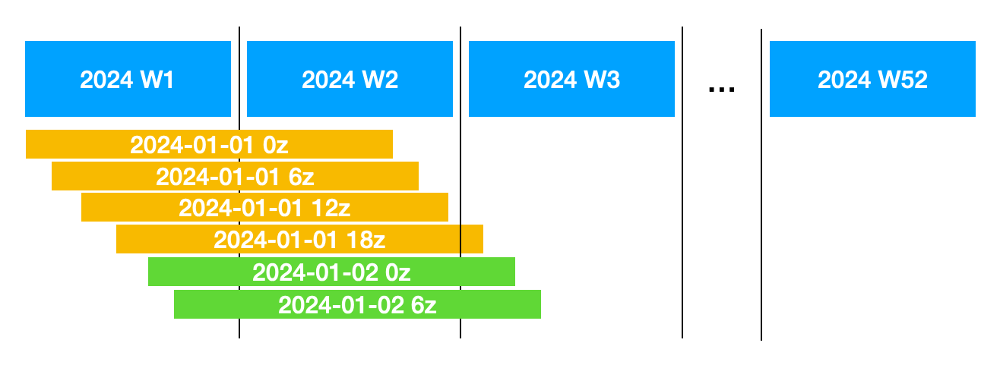
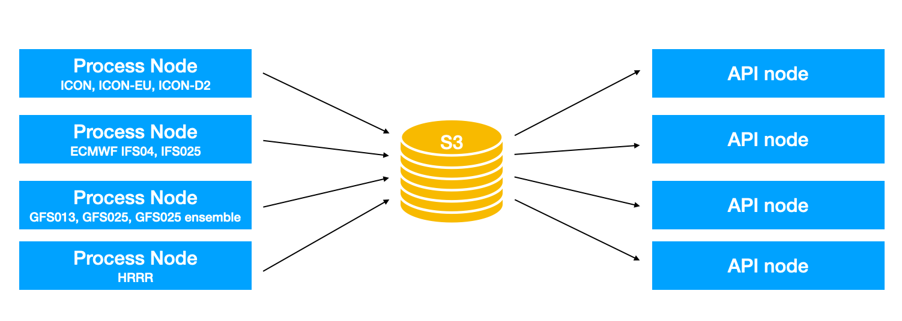

# Notes on Environmental Data Management 

More and more open-data available. Unthinkable 10 years ago. More and more NWPs offer open-data. Higher resolution, global and local area models. Enormous amounts of data, get harder and harder to access.

Open-Meteo sets out to change it. Fully open-source. Redistribute open-data environmental datasets with simple and fast APIs. Open-access for non-commercial use and research. Integrates models from most important NWPs for Europe, North America and Asia.

The following describes how open-meteo is handling large amounts of environmental data, how it works and the direction for future developments for open-meteo as well as other users of environmental data.

## Problem space
working with environmental data like weather forecast model output, reanalysis or satellite data in practice is challenging for end users.

1. Data is big and getting bigger. But only need small portion of data -> have to download hundrets of GB of GRIB files. Huge CPU decoding time, throw away 99% of downloaded and processed data. A lot of effort that is not resource intensive, but also requires a lot of know how. Downloading like ERA5 even for just one location, may take 3-6 months.
2. Difficult to use data. GRIB files, projections, aggregations, jumps from 1 to 3 to 6h data. Correct processing of solar radiation in order to calculate common variables like evapo reference transpiration ET0 or direct normalized irradiation (DNI) is immensely difficult for novice users.
3. So many file formats and standards from various national weather services. No generic solution possible. Getting to know open data from each NWP is time consuming. Hard to discover which data is available. No central catalogue.
4. Complicated integrations. To effectively get to a point where a user can "work" with weather data, it needs countless of libraries, tinkering to download and store data on a workstation, working with projections to find coordinates and work around problems like you cannot fit a year of ERA5-Land temperature data in memory.


## The current Open-Meteo approach
Open-Meteo is only a small step, but makes accessing data more transparent and faster. However, it does not yet solve all issues. Currently, Open-Meteo offers simple HTTP APIs to retrieve a small subset of weather data for individual locations.

Open-Meteo is mostly focused on returning time-series data for coordinates. This is the exact opposite of how environmental is usually stored and distributed. 

Weather models updates are continuously updated into a time-series database, which offers the convenient feature that users cannot only get the latest model forecast, but seamlessly get a time-series from the past model runs. This enables that users can get a weather forecast from the current day which may already incorporate 0z, 6z and 12z, but also get data from past weeks, months and even years.

The database is not limited to weather forecast models, but also includes reanalysis data like ERA5 and ERA5-Land. 80+ years of hourly for a single location data can be accessed within less than 100 milliseconds! This is only possible by storing data efficiently for this use-case and optimizing for performance.

What users can access:

1. Weather forecasts for individual coordinates with integration of local area models for short term forecasting and global models for medium-range forecasting
2. Past weather from high-resolution weather models (archives start ~2018) and reanalysis from ERA5 (1940 onwards with daily updates)
3. Access forecasts with lead-time offsets to optimize for one or two day-ahead forecasting as well as generate validations showing the skill of individual forecast days.
4. Access a large range of weather parameters including model and pressure level variables. Some parameters like Direct Normal Irradiance (DNI) or Reference Evapotranspiration (ET₀) are calculated on demand.
5. Access to individual ensemble member forecasts for probabilistic forecasting. Around 30 to 50 members are available for each model. 
6. Additional datasets like Air Quality based on Copernicus CAMS (EU + Global), Climate models (CMIPS HighRes), various ocean wave models, flood models (GloFAS)

Access is not limited to single coordinates. Multiple coordinates can be requested in one API call as well. Bounding boxes are supported as well, but limited to smaller areas. The bounding box feature is not documented yet.

Currently it is not possible to access forecasts for larger areas (large country / continent) or the entire globe. This is the worst case access pattern for the underlying database. User who want to generate maps, are asked to use GRIB files directly. However, support is technically possible, but requires some development to make it work.


## Storing data

GRIB files work well to store a large field for a single timesteps of a single variable. Compression is reasonable good. To read a single location or small area, the entire field needs to be decoded. If multiple GRIB messages are concatenated in a single file, this requires an index file to access an individual parameters, complicating it further to access GRIB files on demand.

An API serving weather data needs an underlying database which is specifically optimized to ingest large amounts of data and read small portions randomly preferable as a time-series.

The solution is relatively simple to structure weather data in multidimensional arrays, transpose for fast time access and store it on disk in formats like NetCDF, Zarr or HDF5. Data needs to be chunked (e.g. 50 gridpoints x 50 timesteps) and compressed using various formats like gzip, zstd, blosc, lz4 and others.

A 0.25° model with 80 forecast steps every 3 hours has the dimensions of [1440; 720; 80]. Instead of storing each run in its own file, a continuous time-series can be formed by creating one file for every calender week and merge data into existing weekly files, a continuous time-series forms automatically.



By using simple files, data can then be arranged like this:
- `/temperature_2m/`
- `/temperature_2m/2024_week01.nc`
- `/temperature_2m/2024_week02.nc`
- `/temperature_2m/2024_week03.nc`
- `/precipitation/`
- `/precipitation/2024_week01.nc`
- `/precipitation/2024_week02.nc`
- `/precipitation/2024_week03.nc`

To return a forecast for the next 7 days, that starts at local-time midnight, simply open the corresponding weekly files and read data the correct days. Data for the past 10 weeks? Open the last 10 weeks files. Store all 51 ensemble members? Simply add another dimension [1440; 720; 51; 80].

To update the database the workflow looks like:
1. Download GRIB files of latest run
2. Transpose spatial oriented data to temporal access
3. Read existing weekly files
4. Merge new updated data
5. Overwrite weekly files
6. Repeat with next model run

In a very simplified way, this is how Open-Meteo stores weather model updates as a continuous time-series. In practice, individual files are not fixed to individual calendar weeks and updating files is quite a challenge considering that some model updates are hundreds of GB in size.

Storing gridded data as time-series optimized weekly files is tailored to the specific use case of time-series APIs that concatenate multiple weather model runs. In future iterations of Open-Meteo, additional data views may be implemented to support different use-cases like spatial access for maps.


## Open-Meteo custom file format

To store gridded data, Open-Meteo implements its own file format. It is a multi-dimensional chunked array compressed to a single file. This is similar to Zarr, HDF5 or NetCDF. There are 2 major differences why a separate file format was necessary:

1. Compression ratio: The underlying compression is highly optimized for weather data. Weather data is low frequency with a high spatial and temporal correlation. By using multi dimensional delta coding and an integer compression scheme with fixed precision (e.g. 0.05K for temperature), compression ratios are significantly higher than any other compression scheme known in the existing file formats. A drawback is that compression is lossy, however precision can be adjusted to preserve any relevant information. Because the amount of data is enormous, this compression ratio is an absolute top priority!

2. Performance: Compression speed should exceed 1 GB/s single-threaded. Weather model updates need to be applied as quickly as possible while processing large amounts of data. Because data needs to be read from existing files, merged and compressed again, the size of modified data is more than just the size of a single weather model update. With optimizations for SIMD (AVX2, ARM NEON) Open-Meteo reaches compression and decompression of more than 1 GB/s.

Other requirements to store gridded data include (Those are possible with other file formats as well):

1. Concurrent access: It must be possible to read from multiple threads efficiently. The file format is very simple and read/write operations can be implemented very efficiently without allocating additional buffers or keeping track of an internal state. This takes full advantage of CPU concurrency while minimizing locks to enable thousands of parallel API calls. Some libraries like HDF5 struggle with concurrency.

2. Simple / Cloud native: The simple design and chunked data format enables cloud-native access to only partial data of the file. E.g. time-series data from a single coordinate can be read by only downloading the relevant chunks of data instead of the whole file. Currently, no third party libraries exist, but with reasonable amount of effort, libraries for other programming languages can be developed. This is very interesting if the underlying Open-Meteo files should be accessed directly from different systems without using the Open-Meteo APIs. As Open-Meteo is already offering the database files as open-data through AWS open-data, there is an increasingly number of requests to have libraries to read Open-Meteo files.

3. Streaming updates to large amounts of data that exceed the amount of computer memory. By iterating through data, it can be processed in small chunks. E.g. data for ERA5-Land (0.1°) is stored in one file per year with dimensions [3600, 1800, 8760] which would require 211.46 GB of memory as Floating point array (after compression 9.0 GB, 23x compression ratio due to missing values for sea). ERA5 0.25° would require [1444, 720, 8760] => 34 GB of raw floating point array size (4.0GB compressed, 11.3x compression ratio).

4. Single independent files to copy atomically. By using normal files, it is easy copy them to different servers or cloud storages. Because data is updated while being read from, a file copy must be atomic. Some file libraries or database systems store data in files that cannot be copied atomically.


With the Open-Meteo file format, it certainly reinvents the wheel. However, the existing file formats do not fit the requirements and the amount of effort to implement a new file format was not too high. The file format is now in use for over 2 years and works extremely well. It requires some iterations to make it more portable and flexible, but overall it is certainly the only viable approach for Open-Meteo.

The next revision of the Open-Meteo file format should mainly address:
- Python library with support for sync, sans IO, S3 cloud native, integrations with XArray
- JavaScript client with compression done in WebAssembly. This can enable efficient client side maps visualizations.
- Potability to support various data dimensions and data types

A technical description about the file format is available here: https://github.com/open-meteo/open-data?tab=readme-ov-file#file-format


## Processing data from NWS

Over the past years, Open-Meteo integrated weather models from all major national weather services. Additionally reanalysis models like ERA5, ERA5-Land or CERRA have been downloaded and made available again as time-series API.

Every single weather service uses its own distribution system, conventions and different file formats. Most of them due use GRIB or NetCDF, but the content, naming convention, structure, projections, available parameters, forecast horizon is different for each weather model. It is very challenging to get a good overview of all available open-data from various national weather services. Open-Meteo combines all data sources into a new naming scheme and tries to keep it consistent as possible, but of course it is constantly changing with each new model.

For each weather model, specialized download and conversion routines are implemented. Model runs are downloaded as timely as possible to provide the most up to date forecast. Due to the amount of data for each update, this process has been optimized over the years:

1. Downloader are started a couple of minutes before each run should be available on the open-data servers. HTTP downloads pro-actively try to download files. If the file is not yet available (error 404), it will be retried in minute. If available, the downloader use GRIB index file to reduce the amount of data transferred from open-data servers.

2. GRIB files are transferred and processed at the same time. Initially, Open-Meteo downloaded files do disk and then processed them using eccodes. This took too long and requires disk space and more memory. Because GRIB files contain multiple messages, the download is done streaming and after each message was received it is directly processed. This enables to process an incoming GRIB stream of >100 MB/s per second. Right now it is mostly limited by network speed and larger volumes of GRIB files can be processed timely. Open-Meteo keeps network bandwidth to reasonable levels to not overload open-data servers.

3. Because data is downloaded as spatial files with a 2-dimensional array for each timestep, data is then transposed to time-series access. The data transposition is done in chunks to efficiently work on large amount of data.

4. Depending on the model, derived weather variables are calculated if required (e.g. Pressure level relative humidity is used to estimate low/mid/high cloud cover). Aggregations like cumulative precipitation are resolved to precipitation per hour. Additionally, if data is changing temporal resolution from 1-hourly to 3 or 6-hourly in the middle the forecast, all data is interpolated to 1-hourly. This includes interpolations to deaverage solar radiation while considering the solar zenith angle. 

5. Finally, the time-series database containing existing weekly files is updated. Data downloading and processing is performed concurrently on all available CPU cores. Updates are performed in chunks and require low amounts of system memory although hundreds of gigabyte of data are processed.

6. Optionally, the updated Open-Meteo database is uploaded to a S3 compatibly storage. Per default, the Open-Meteo database is just a single directory `./data` on a local hard disk.

All downloader are implemented in the open-source code of Open-Meteo. Prebuilt binaries are available for Ubuntu alongside Docker images. Downloading a single model run of ECMWF 0.25° and updating the Open-Meteo database is reduced to a single command on the terminal:

```bash
openmeteo-api download-ecmwf --domain ifs025 --run 2024090100 --concurrent 4 --only-variables temperature_2m,precipitation --server https://data.ecmwf.int/forecasts/
```

This particular downloader is optimized for the open-data distribution from ECMWF IFS 0.25 and downloads data from the specified server. However, the data source could local directory with GRIB files as well. Addtional datasets and workflows can be implemented quickly. A current list of all implemented weather models can be found here: https://github.com/open-meteo/open-data

As of September 2024, Open-Meteo downloads and processes 2.8 TB of GRIB / NetCDF files per day. A time-series of th past 90 days of all weather forecast models requires roughly 1.8 TB of storage.

The list of additional datasets and weather models is virtually endless. Next on the list are:
- NOAA NBM and RRFS
- Satellite radiation datasets (SARAH3, MeteoSat)
- Radar datasets (DWD Radolan, OPERA)


## Open-Meteo database

Open-Meteo stores all data as files following a simple directory structure. One directory for the weather model name, followed one directory for each weather variable. Each variable contains than files which contains 1-2 weeks of data.

The database can also be accessed on AWS S3 Open-Data: https://openmeteo.s3.amazonaws.com/index.html#data/

```
data/ecmwf_ifs025/temperature_2m
|- chunk_7435.om
|- chunk_7436.om

data/ecmwf_ifs025/precipitation
|- chunk_7435.om
|- chunk_7436.om

data/ecmwf_ifs025/wind_u_component_10m
|- chunk_7435.om
|- chunk_7436.om

data/dwd_icon_d2/temperature_2m
|- chunk_18635.om
|- chunk_18636.om

data/dwd_icon_d2/precipitation
|- chunk_18635.om
|- chunk_18636.om
```

For reanalysis datasets, file span entire years. They are still accompanied by weekly files for daily updates because updating only a single day inside a 365 day block of data is rather inefficient. 

```
data/copernicus_era5/temperature_2m
|- year_2020.om
|- year_2021.om
|- chunk_949.om
|- chunk_950.om
```

The chunk-number is just the unix-timestamp divided by a time-interval of 1-2 weeks. It is trivial to figure out which files need to be read read.

The total size of the Open-Meteo database spans around 41 TB. Compression ratio is approximately 5 times better than GRIB, therefore the archives are equivalent to ~200 TB of GRIB files:
- 16 TB for common variables from ERA5, ERA5-Land, CERRA and archived ECMWF IFS HRES
- 23 TB for continuous archives of all weather forecast models keeping different lead-times
- 2 TB archives for various models air quality, floods, waves, etc

Because the entire database is just a collection files and directories, it can just be copied by standard tools and exposed via any simple HTTP server or S3 compatible server.

By exposing the Open-Meteo database directly through an HTTP server or S3 bucket, users can
1. Run their own Open-Meteo API instances and synchronize automatically the latest forecast or
2. Retrieve data directly from files to perform data analysis in Python once the Python library for open-meteo files is available


## HTTP Rest APIs
To efficiently serve weather data to a wide audience of users, data can be exposed as a HTTP JSON API.

Data for individual coordinates can be requested by a simple URL query `/v1/forecast?latitude=47.45&longitude=8.56` followed by a list of weather variables like `&hourly=temperature_2m,precipitation` which returns a weather forecast in JSON format for the next 7 days in 1-hourly resolution. 

In order to provide a good forecast, Open-Meteo performs a couple of steps:
1. The best weather models for the given coordinates are selected. High resolution local domains like ICON-D2, AROME or HRRR are combined seamlessly with their global parent domains like ICON, ARPEGE or GFS. Therefore the first couple of hours might be from a local area model, while the mid-term forecast is based on a global model. The model selection process can be overruled by simply adding `&models=ecmwf_ifs025` to force a specific model.

2. A suitable grid-cell is selected for the coordinated. Various grid systems and projections are supported to quickly find the corresponding grid-cell for coordinates. By using a digital elevation model, the surface elevations from the desired coordinate as well as surrounding grid-cells are compared. Sometimes not the nearest grid-cell provides a best forecast for a given location. In coastal areas, grid-cells on sea are avoided.

3. If required, data is interpolated from 3-hourly to 1-hourly data. Most weather models offer 1-hourly data. As a convention only 1-hourly data is returned. Of course the user can choose the temporal resolution as well.

3. Derived parameters are calculated. E.g. wind speed is computed from U/V vectors. More complex models are also integrated like FAO Reference Evapotranspiration (ET₀), Direct Normal Irradiance (DNI) or directly compute the tilted solar irradiance. All solar radiation calculations are using the NREL solar position algorithms which is reportedly have the highest accuracy. Those models were frequently requested by users from renewable energy or agriculture sectors.

4. The API response as JSON (or other formats) is streamed back to the user. The response could return large amounts of data that do not fit into memory. By streaming data into chunks, the API can return large amounts of data without the need for complex job queuing systems.

5. Optionally, an API key is checked to verify that a user is authorized to access data. Open-Meteo limits access to the free API and blocks access after 10'000 calls per day. Commercial users can retrieve more data, but require an API key.

The Open-Meteo API is not limited to single coordinates. Other options are:
1. Multiple coordinates by supplying a comma separated list. E.g. `&latitude=47.45,48.1,49.23&longitude=8.56,8.34,8.43`. Limited to 1000 locations.

2. Bounding boxes to get data for a geographic area. `&bounding_box=47,-85,47.5,-84.5`. Currently this is limited to roughly 1000 grid-cells.

Future API features:
1. Maps API: More and more users are asking to get data for large areas to generate map. Open-Meteo is optimized for time-series data, therefore maps are a worst-case usage. So far we recommend GRIB files for maps, but users have issues processing data. It would be nice to have a simple endpoint to get data for large areas to generate maps.

2. Cloud native mode: The API requires that the database is available locally. This is important to the best performance to serve weather data within milliseconds. However, due to the growing size of the Open-Meteo database, it can be challenging to deploy server with large local disk storage. A cloud native mode should enable the API to fetch data on demand from an S3 server containing all Open-Meteo files. By keeping important data in a local cache, this can provide reasonable performance while making it very easy to deploy more Open-Meteo API nodes.


The API is distributed as Ubuntu packages and Docker images as well. The HTTP server endpoint can be started with a single command:

```bash
openmeteo-api serve
# [ NOTICE ] Server started on http://0.0.0.0:8080
```

### Server setup and data distribution

Although the API is presented as a single endpoint, Open-Meteo uses a lot of servers to distribute data processing. To download and process data, multiple virtual machines from cloud providers are used.

Very simplified the Open-Meteo system consists of:
- Processing nodes to download and process weather model data
- A S3 like central storage to keep all data and distribute it further
- API nodes that fetch data from S3 and serve data to users



Open-Meteo uses a slightly different architecture: each Processing node exposes an S3 server and API nodes directly fetch data from each processing node. For an easier understanding the S3 storage can be viewed independently.

Although Open-Meteo is a distributed system, it can run on a single computer, processing data and running the API. However, at a certain scale, a single system is not practical anymore multiple servers are required.

### Process Nodes
Instances in North America are used to download and process data from NOAA and the Canadian weather service. Instances in Europe processes data from European weather services. Latency to the open-data servers plays a big role in processing speed for new runs.

Each instances autonomously processes a couple of modes. E.g. Open-Meteo uses the following instances to process different models:
- Process-us01: GFS013, GFS025, GFS025 ensemble
- Process-us02: GEM global, RDPS, HRDPS, global ensemble
- Process-us03: HRRR
- Process-eu01: ICON, ICON-EU, ICON-D2
- Process-eu02: MeteoFrance AROME, AROME-HD, ARPEGE Europe, ARPEGE World
- and so on

By dividing processing to many instances, this makes it easier to scale and add new weather models. Different weather models have different CPU, memory and disk requirements that can be more easily balanced with distributed systems. For processing nodes, reliable servers are used to decrease the likelihood of failures.


### Central S3 storage 
Each instance maintains its own Open-Meteo database for its weather models and after each update synchronizes data on a central S3 storage. 

This S3 storage can be an AWS S3 bucket, but any S3 like service works. The Open-Meteo API actually contains its own S3 server implementation and no third party software is required. However, a proper S3 storage is recommended to scale the service.

### API Nodes

The API nodes synchronize data from the S3 storage. They check every couple of minutes for modifications and download modified files via HTTP. The Open-Meteo API embeds a synchronization utility to selectively download only the desired weather variables.

E.g. the following command will download all required files files that contain temperature on 2 metre above ground for the past 90 days and 10 days forecast. Additionally it will check every 5 minutes if files got modified (new run is available) and download the updated data.

```bash 
openmeteo-api sync ecmwf_ifs025 temperature_2m --past-days 90 --repeat-interval 5
```

Per default, data will be downloaded from the public open-meteo S3 repository. With the parameter `--server https://my-s3-server.domain.tld/` data can be downloaded from a different server.


Open-Meteo uses multiple dedicated servers with a load-balancer to serve data. Each API node typically has 2 TB storage to keep the recent 90 days of all weather forecast models on disk. The actual API nodes do not need reliable hardware. If a single API node fails, is does not effect API availability due to load-balancing.

### Disk space requirements

Below are approximately sizes how much storage an individual weather model requires with 90 days past data and forecast. Some models include pressure level variables which increase size significantly.

| Size | Model                     |
|------|------------------------------------|
| 99G  | bom_access_global                  |
| 117G | cma_grapes_global                  |
| 58G  | cmc_gem_gdps                       |
| 109G | cmc_gem_hrdps                      |
| 35G  | cmc_gem_rdps                       |
| 9.8G | copernicus_dem90                   |
| 84G  | dmi_harmonie_arome_europe          |
| 151G | dwd_icon                           |
| 30G  | dwd_icon_d2                        |
| 15G  | dwd_icon_d2_15min                  |
| 43G  | dwd_icon_eu                        |
| 9.6G | ecmwf_aifs025                      |
| 17G  | ecmwf_ifs025                       |
| 4.8G | ecmwf_ifs04                        |
| 2.0G | jma_gsm                            |
| 2.7G | jma_msm                            |
| 6.4G | knmi_harmonie_arome_europe         |
| 3.5G | knmi_harmonie_arome_netherlands    |
| 30G  | meteofrance_arome_france0025       |
| 22G  | meteofrance_arome_france0025_15min |
| 54G  | meteofrance_arome_france_hd        |
| 32G  | meteofrance_arome_france_hd_15min  |
| 21G  | meteofrance_arpege_europe          |
| 54G  | meteofrance_arpege_world025        |
| 25G  | metno_nordic_pp                    |
| 91G  | ncep_gfs013                        |
| 137G | ncep_gfs025                        |
| 4.4G | ncep_gfs_graphcast025              |
| 87G  | ncep_hrrr_conus                    |
| 85G  | ncep_hrrr_conus_15min              |
| 172G | ukmo_global_deterministic_10km     |
| 61G  | ukmo_uk_deterministic_2km          |

If historical weather forecast and reanalysis data is stored as well, more space is required. As of 2024-09-03 the database size is:


Ensemble models with 14 days past data: (Note: Ensemble models are not archived, yet)

| Size | Model                     |
|------|------------------------------------|
| 19G  | bom_access_global_ensemble          |
| 14G  | cmc_gem_geps                        |
| 71G  | dwd_icon_d2_eps                     |
| 114G | dwd_icon_eps                        |
| 27G  | dwd_icon_eu_eps                     |
| 193G | ecmwf_ifs025_ensemble               |
| 60G  | ecmwf_ifs04_ensemble                |
| 51G  | ncep_gefs025                        |
| 71G  | ncep_gefs05                         |


## Cloud Native Python Library

Currently, users can only retrieve data from via a JSON API. The API can then efficiently return a small subset of data and the client only get the amount of data he actually needs. The client also does not require a processing power which is ideal for low power systems or handhelds.

For some use cases like machine learning it can be useful to process nearly all data. Going through an API can be cumbersome. The client also has sufficient processing capabilities to work with larger amounts of data. In this case a cloud native approach can be ideal.

The client could directly fetch the required data from the Open-Meteo files on S3.  


Currently only libraries to interact with API. 

Work in progress:
- Make file format more generic
- Client libraries for python, etc

Direct access to files on S3 storage. Local cache. Enable users to run analysis without worrying about data transfer, etc. Strict backwards compatibility.

Other languages like Javascript, WASM, R, Julia, Rust, Swift, etc

Make file format usable in different sectors as well. Areas to improve global metadata schema and standards.

Users still have to option to download, store and archive the whole file.
