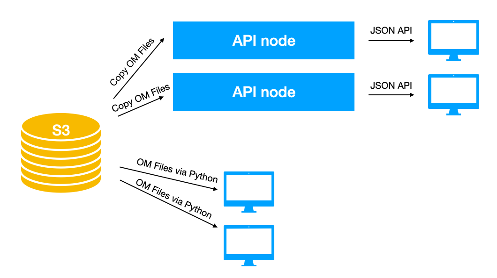

# Considerations on Environmental Data Management

The availability of open environmental data has grown exponentially, reaching levels that would have been unimaginable just a decade ago. National Weather Prediction (NWP) systems are increasingly offering open-access data, including high-resolution models that cover both global and local areas. However, as the volume of this data expands, accessing and utilizing it efficiently is becoming increasingly challenging.

Open-Meteo aims to address these challenges by revolutionizing the way environmental datasets are distributed and accessed. As a fully open-source platform, Open-Meteo provides streamlined access to environmental data through fast and user-friendly APIs. These services are open for non-commercial and research purposes and integrate models from the leading NWPs across Europe, North America, and Asia.

This paper outlines the strategies employed by Open-Meteo to manage large-scale environmental data, describes its operational mechanics, and discusses future directions for Open-Meteo and other entities that handle environmental datasets.

## Challenges in Environmental Data Management

Managing environmental data, such as weather forecasts, reanalysis, and satellite data, presents significant challenges for end users. These challenges are particularly pronounced in the following areas:

1. **Data Volume and Accessibility:** The sheer volume of environmental data is immense and continues to grow. Users often require only a small subset of this data, but are forced to download and process vast amounts—sometimes hundreds of gigabytes of GRIB files—just to extract the information they need. This not only results in substantial data download times time but also leads to the inefficient use of resources, as up to 99% of the downloaded and processed data may be discarded. For instance, downloading ERA5 data for a single location can take anywhere from three to six months, underscoring the time-consuming nature of this process.

2. **Complexity of Data Usage:** The use of environmental data is complicated by various factors, such as the GRIB file format, varying data projections, and irregular temporal resolutions (e.g., data jumps from 1-hour to 3-hour to 6-hour intervals). Accurately processing this data to derive commonly used variables, such as reference evapotranspiration (ET0) or direct normal irradiance (DNI), is a daunting task for less experienced users.

3. **Diverse File Formats and Standards:** Environmental data is provided in numerous file formats and follows different standards depending on the source, typically from national weather services. There is no universal solution to accommodate this diversity, making it time-consuming for users to familiarize themselves with the specific data offerings of each NWP. Furthermore, discovering available data can be a challenge due to the absence of a centralized catalog.

4. **Complex Integrations:** To effectively utilize weather data, users must navigate a complex ecosystem of libraries and tools to download, store, and process data on their local systems. This includes working with various projections to determine coordinates and addressing practical challenges, such as the inability to load an entire year of ERA5-Land temperature data into memory.

By addressing these challenges, Open-Meteo and similar initiatives aim to democratize access to environmental data, making it easier and more efficient for users to engage with this critical information. The following sections will delve into the specific methods and technologies employed by Open-Meteo to overcome these obstacles and outline the anticipated advancements in this field.


## The Current Open-Meteo Approach
Open-Meteo represents an incremental yet significant step forward in making environmental data more accessible, transparent, and faster to retrieve. However, it does not yet address all the challenges associated with environmental data management. Presently, Open-Meteo provides simple HTTP APIs that allow users to retrieve a limited subset of weather data for specific locations.

The primary focus of Open-Meteo is on delivering time-series data for specific coordinates, which contrasts with the traditional method of storing and distributing environmental data. Weather model outputs are continuously ingested into a time-series database, enabling users to not only access the latest model forecasts but also seamlessly retrieve historical data from past model runs. This allows users to obtain weather forecasts that include updates from multiple model runs (e.g., 0z, 6z, and 12z) and to access historical data spanning weeks, months, or even years.

The database's capabilities extend beyond just weather forecast models; it also includes reanalysis data such as ERA5 and ERA5-Land. Users can access over 80 years of hourly data for a single location in less than 100 milliseconds, thanks to the efficient data storage and performance optimization tailored for this use case.


### What Users Can Access:

1. **Weather Forecasts:** Time-series data for individual coordinates, integrating local area models for short-term forecasts and global models for medium-range forecasts.

2. **Historical Weather Data:** High-resolution weather model archives (starting around 2018) and ERA5 reanalysis data (available from 1940 onwards with daily updates).

3. **Lead-Time Forecasting and Validation:** Access to forecasts with lead-time offsets to optimize for short-term forecasting (one or two days ahead) and the ability to generate validations to assess the accuracy of individual forecast days.

4. **Wide Range of Weather Parameters:** A variety of weather parameters, including model-specific and pressure level variables. Certain parameters, such as Direct Normal Irradiance (DNI) and Reference Evapotranspiration (ET₀), are calculated on demand.

5. **Ensemble Forecasting:** Access to probabilistic forecasts through individual ensemble member data, with 30 to 50 members available per model.

6. **Additional Datasets:** Access to air quality data based on Copernicus CAMS (covering Europe and globally), climate models (CMIP HighRes), various ocean wave models, and flood models (GloFAS).

Users are not limited to requesting data for a single coordinate; multiple coordinates can be queried in a single API call. Additionally, bounding boxes can be used to request data for smaller areas, although this feature is currently undocumented.

At present, it is not possible to access forecasts for larger areas, such as entire countries, continents, or the globe. Such requests are the most challenging for the underlying database, and users who need to generate maps are advised to use GRIB files directly. However, with further development, support for these broader queries could be implemented.


### Data Storage

GRIB files are effective for storing large fields corresponding to single time steps of individual variables, offering reasonably good compression. However, to access data for a specific location or small area, the entire field must be decoded. When multiple GRIB messages are concatenated in a single file, an index file is required to access individual parameters, further complicating on-demand access to GRIB files.

To efficiently serve weather data through an API, the underlying database must be optimized for ingesting large volumes of data and for retrieving small, specific portions—preferably as time-series data.

A practical solution involves structuring weather data into multidimensional arrays, transposing the data for quick time access, and storing it in formats like NetCDF, Zarr, or HDF5. The data should be chunked (e.g., 50 grid points x 50 time steps) and compressed using formats such as gzip, zstd, blosc, lz4, among others.

For instance, a weather model with a 0.25° resolution and 80 forecast steps every 3 hours would have dimensions of [1440; 720; 80]. Instead of saving each run in a separate file, a continuous time-series can be formed by creating one file per calendar week and merging the new data into these weekly files. This automatically generates a continuous time-series.


The data can then be organized in a straightforward directory structure, such as:
- `/temperature_2m/`
- `/temperature_2m/2024_week01.nc`
- `/temperature_2m/2024_week02.nc`
- `/temperature_2m/2024_week03.nc`
- `/precipitation/`
- `/precipitation/2024_week01.nc`
- `/precipitation/2024_week02.nc`
- `/precipitation/2024_week03.nc`

To provide a 7-day forecast starting at midnight local time, the system simply opens the corresponding weekly files and reads the relevant data. Need data for the past 10 weeks? The system accesses the files for the last 10 weeks. Storing data for all 51 ensemble members? This is easily managed by adding another dimension, resulting in a structure like [1440; 720; 51; 80].

The process for updating the database is as follows:

1. Download the latest GRIB files from the model run.
2. Transpose the spatially-oriented data for temporal access.
3. Read the existing weekly files.
4. Merge the new data with the existing data.
5. Overwrite the weekly files with the updated data.
6. Repeat the process for the next model run.

This simplified approach illustrates how Open-Meteo stores weather model updates as a continuous time-series. In practice, however, the files are not strictly tied to individual calendar weeks, and updating them can be complex, particularly when model updates involve hundreds of gigabytes of data.

Storing gridded data as time-series optimized weekly files is specifically designed to support time-series APIs that aggregate multiple weather model runs. Future iterations of Open-Meteo may introduce additional data views to accommodate other use cases, such as spatial access for map generation.


## Open-Meteo custom file format

To efficiently store gridded data, Open-Meteo has developed its own custom file format. This format consists of a multi-dimensional chunked array compressed into a single file, similar to formats like Zarr, HDF5, or NetCDF. However, there are two key reasons why a separate file format was necessary:

1. **Compression Ratio:** The compression method used in the Open-Meteo format is highly optimized specifically for weather data, which typically exhibits low frequency with high spatial and temporal correlation. By employing multi-dimensional delta coding and an integer compression scheme with fixed precision (e.g., 0.05K for temperature), this format achieves significantly higher compression ratios than existing file formats. Although the compression is lossy, the precision can be adjusted to preserve any important information. Given the vast amount of data involved, maximizing compression efficiency is a top priority.

2. **Performance:** The compression process is designed to exceed speeds of 1 GB/s on a single thread. Since weather model updates must be applied quickly and involve processing large data volumes, the ability to rapidly read from, merge, and recompress data is crucial. With optimizations for SIMD (AVX2, ARM NEON), Open-Meteo can achieve compression and decompression speeds of over 1 GB/s.

In addition to these primary considerations, the file format also meets other essential requirements for storing gridded data, which are also achievable with other formats:

1. **Concurrent Access:** The format supports efficient multi-threaded reading. Its simple design allows read/write operations to be implemented without requiring additional buffers or complex state management, enabling full CPU concurrency with minimal locking. This allows for thousands of parallel API calls, something that can be challenging for other formats like HDF5.

2. **Simplicity and Cloud-Native Design:** The straightforward, chunked data structure is well-suited for cloud-native environments, allowing for partial file access. For example, time-series data for a single coordinate can be accessed by downloading only the relevant data chunks, rather than the entire file. Although no third-party libraries currently exist for this format, it is relatively easy to develop such libraries for other programming languages. This is particularly valuable for accessing Open-Meteo files directly from different systems without relying on the Open-Meteo APIs. Given that Open-Meteo already offers its database files as open data via AWS, there is growing interest in developing libraries to read these files.

3. **Streaming Updates for Large Datasets:** The format supports streaming updates for datasets that exceed available memory. By processing data in small chunks, large files can be managed efficiently. For instance, ERA5-Land data (0.1° resolution) is stored in yearly files with dimensions [3600, 1800, 8760], which would require 211.46 GB of memory as a floating-point array. After compression, this size is reduced to 9.0 GB, achieving a 23x compression ratio due to missing sea data. ERA5 data at 0.25° resolution would require [1444, 720, 8760] => 34 GB in raw floating-point array size, compressed to 4.0 GB with an 11.3x compression ratio.

4. **Atomic File Copies:** The format’s use of standard files allows for easy copying to different servers or cloud storage. Since the data can be updated while being accessed, atomic file copying is essential. Some file libraries or database systems store data in ways that do not support atomic copying, but the Open-Meteo format avoids this issue.

While developing a custom file format may seem like "reinventing the wheel," existing formats did not meet the specific requirements for Open-Meteo, and the effort to create a new format was manageable. This file format has been in use for over two years and has proven to be highly effective. Although further iterations may be needed to improve portability and flexibility, it remains the most viable solution for Open-Meteo's needs.

A technical description of the file format can be found here: [Open-Meteo File Format](https://github.com/open-meteo/open-data?tab=readme-ov-file#file-format)


## Processing Data from National Weather Services

Over recent years, Open-Meteo has integrated weather models from all major national weather services, along with reanalysis models like ERA5, ERA5-Land, and CERRA, making them available through its time-series API.

Each weather service utilizes its own distribution systems, conventions, and file formats. While most use GRIB or NetCDF formats, the content, naming conventions, structure, projections, available parameters, and forecast horizons vary for each weather model. This diversity makes it challenging to gain a comprehensive overview of the available open data across various national weather services. Open-Meteo addresses this by consolidating all data sources into a unified naming scheme, striving for consistency despite the constant changes introduced with each new model.

To manage this diversity, specialized routines for downloading and converting data are implemented for each weather model. The model runs are downloaded as promptly as possible to ensure the most up-to-date forecasts. This process has been refined over the years to handle the substantial data volume efficiently:

1. **Proactive Downloading:** Download processes begin a few minutes before each model run is expected to be available on the open-data servers. HTTP downloads proactively attempt to access files. If a file is not yet available (error 404), the download is retried every minute until successful. Once available, the downloader uses GRIB index files to minimize the data transferred from the open-data servers.

2. **Simultaneous Transfer and Processing:** GRIB files are transferred and processed simultaneously. Initially, Open-Meteo saved files to disk before processing them with eccodes, which was time-consuming and required significant disk space and memory. Now, as GRIB files contain multiple messages, the download is streamed, and each message is processed immediately after receipt. This allows for processing incoming GRIB streams at speeds exceeding 100 MB/s, with current limitations primarily due to network speed. This optimization ensures timely processing of large GRIB files while managing network bandwidth to avoid overloading the open-data servers.

3. **Data Transposition:** Since data is downloaded as spatial files with a two-dimensional array for each timestep, it is then transposed for time-series access. This transposition is done in chunks to efficiently handle large volumes of data.

4. **Derived Variables and Interpolation:** Depending on the model, derived weather variables are calculated as needed (e.g., estimating low/mid/high cloud cover from pressure level relative humidity). Aggregations, such as cumulative precipitation, are resolved into hourly precipitation values. Additionally, if the data's temporal resolution shifts mid-forecast (e.g., from 1-hourly to 3 or 6-hourly), all data is interpolated to a consistent 1-hourly resolution. This includes solar radiation de-averaging, which accounts for the solar zenith angle during interpolation.

5. **Updating the Time-Series Database:** The time-series database, containing existing weekly files, is updated. Data downloading and processing occur concurrently across all available CPU cores. Updates are executed in chunks, requiring minimal system memory despite processing hundreds of gigabytes of data.
Optional Database Upload: The updated Open-Meteo database can be optionally uploaded to S3-compatible storage. By default, the Open-Meteo database is stored locally in a single directory, ./data.

All downloaders are implemented in Open-Meteo's open-source code. Prebuilt binaries are available for Ubuntu, along with Docker images. Downloading a single ECMWF 0.25° model run and updating the Open-Meteo database can be accomplished with a single terminal command:

```bash
openmeteo-api download-ecmwf --domain ifs025 --run 2024090100 --concurrent 4 --only-variables temperature_2m,precipitation --server https://data.ecmwf.int/forecasts/
```

This downloader is optimized for ECMWF IFS 0.25° open-data distribution and downloads data from the specified server. However, it can also work with local directories containing GRIB files. Additional datasets and workflows can be implemented quickly. A current list of all integrated weather models can be found here: [Open-Meteo Open-Data GitHub](https://github.com/open-meteo/open-data).

As of September 2024, Open-Meteo downloads and processes 2.8 TB of GRIB/NetCDF files daily. Maintaining a time series of the past 90 days for all weather forecast models requires approximately 1.8 TB of storage.

The potential for adding new datasets and weather models is virtually limitless. Upcoming additions include:
- NOAA NBM and RRFS
- Satellite radiation datasets (SARAH3, MeteoSat)
- Radar datasets (DWD Radolan, OPERA)


## Open-Meteo Database

Open-Meteo organizes its data into files using a straightforward directory structure. Each weather model has its own directory, within which there are subdirectories for each weather variable. These subdirectories contain files that typically hold 1-2 weeks of data.

The database is also accessible via AWS S3 Open-Data: [Open-Meteo S3](https://openmeteo.s3.amazonaws.com/index.html#data/).

```
data/ecmwf_ifs025/temperature_2m
|- chunk_7435.om
|- chunk_7436.om

data/ecmwf_ifs025/precipitation
|- chunk_7435.om
|- chunk_7436.om

data/ecmwf_ifs025/wind_u_component_10m
|- chunk_7435.om
|- chunk_7436.om

data/dwd_icon_d2/temperature_2m
|- chunk_18635.om
|- chunk_18636.om

data/dwd_icon_d2/precipitation
|- chunk_18635.om
|- chunk_18636.om
```

For reanalysis datasets, files span entire years. However, they are also supplemented with weekly files for daily updates, as updating just a single day within a 365-day data block would be highly inefficient.

```
data/copernicus_era5/temperature_2m
|- year_2020.om
|- year_2021.om
|- chunk_949.om
|- chunk_950.om
```

The chunk number is simply the Unix timestamp divided by a time interval of 1-2 weeks, making it easy to determine which files need to be accessed.

The Open-Meteo database currently spans approximately 41 TB. With a compression ratio about five times more efficient than GRIB, this equates to roughly 200 TB of GRIB files:
- 16 TB for common variables from ERA5, ERA5-Land, CERRA, and archived ECMWF IFS HRES.
- 23 TB for continuous archives of all weather forecast models, preserving different lead times.
- 2 TB for archives of various models, including air quality, floods, and waves.

Since the entire database consists of simple files and directories, it can be copied using standard tools and served via any basic HTTP server or S3-compatible service.

By hosting the Open-Meteo database on an HTTP server or S3 bucket, users can:

1. Run their own Open-Meteo API instances, automatically syncing with the latest forecasts.
2. Retrieve data directly from the files for analysis in Python, once the Python library for Open-Meteo files is available.

## HTTP Rest APIs
To efficiently deliver weather data to a broad audience, Open-Meteo offers an HTTP JSON API.

Users can request data for specific coordinates with a simple URL query, such as `/v1/forecast?latitude=47.45&longitude=8.56`, followed by a list of weather variables like `&hourly=temperature_2m,precipitation`. This returns a 7-day weather forecast in JSON format with hourly resolution.


Open-Meteo follows several steps to provide accurate forecasts:


Open-Meteo follows several steps to provide accurate forecasts:

1. **Model Selection:** The API selects the best weather models for the given coordinates, seamlessly combining high-resolution local models like ICON-D2, AROME, or HRRR with their global counterparts like ICON, ARPEGE, or GFS. For example, the first few hours may use data from a local model, while the mid-term forecast relies on a global model. Users can override this selection by specifying a particular model using &models=ecmwf_ifs025.
2. **Grid-Cell Selection:** The API identifies the most suitable grid-cell for the specified coordinates. Various grid systems and projections are supported to quickly locate the corresponding grid-cell. A digital elevation model compares the surface elevation of the desired coordinates with surrounding grid-cells, ensuring that the best grid-cell is chosen, especially in coastal regions where cells over the sea are avoided.
3. **Data Interpolation:** If necessary, the API interpolates data from 3-hourly to 1-hourly intervals. While most models offer 1-hourly data, the API conventionally returns 1-hourly data, although users can select a different temporal resolution.
4. **Derived Parameters:** The API calculates derived weather parameters, such as wind speed from U/V vectors. It also integrates more complex models, like FAO Reference Evapotranspiration (ET₀) and Direct Normal Irradiance (DNI), using highly accurate NREL solar position algorithms. These calculations are particularly valuable for users in the renewable energy and agriculture sectors.
5. **Data Streaming:** The API response, typically in JSON format, is streamed back to the user. To handle potentially large datasets that exceed memory limits, data is streamed in chunks, allowing the API to deliver extensive data without requiring a complex job queuing system.
6. **API Key Verification:** An optional API key check ensures users are authorized to access the data. Free API access is capped at 500 calls per minute or 10,000 calls per day, with commercial users requiring an API key for additional data access.

The Open-Meteo API also supports additional options:

1. **Multiple Coordinates:** Users can request data for multiple locations by supplying a comma-separated list of coordinates, e.g., &latitude=47.45,48.1,49.23&longitude=8.56,8.34,8.43, limited to 1,000 locations.
2. **Bounding Boxes:** Data can be retrieved for a specific geographic area using bounding boxes, e.g., &bounding_box=47,-85,47.5,-84.5, with a current limit of approximately 1,000 grid-cells.


Future API Features:
2. **Maps API:** As user demand grows for data covering large areas to generate maps, Open-Meteo plans to develop a dedicated endpoint for this purpose. Although the API is optimized for time-series data, and map generation is a challenging use case, a simplified endpoint could facilitate map creation.
3. 
4. **Cloud-Native Mode:** Currently, the API requires local access to the database for optimal performance, serving weather data within milliseconds. However, as the Open-Meteo database continues to expand, deploying servers with large local storage becomes increasingly challenging. A cloud-native mode would enable the API to fetch data on demand from an S3 server hosting the Open-Meteo files. By maintaining a local cache of essential data, this approach could balance performance with ease of deployment for additional API nodes.

The Open-Meteo API is available as Ubuntu packages and Docker images. The HTTP server endpoint can be launched with a single command.

```bash
openmeteo-api serve
# [ NOTICE ] Server started on http://0.0.0.0:8080
```

### Server setup and data distribution

Although the API is presented as a single endpoint, Open-Meteo uses a lot of servers to distribute data processing. To download and process data, multiple virtual machines from cloud providers are used.

Very simplified the Open-Meteo system consists of:
- Processing nodes to download and process weather model data
- A S3 like central storage to keep all data and distribute it further
- API nodes that fetch data from S3 and serve data to users


Open-Meteo uses a slightly different architecture: each Processing node exposes an S3 server and API nodes directly fetch data from each processing node. For an easier understanding the S3 storage can be viewed independently.

Although Open-Meteo is a distributed system, it can run on a single computer, processing data and running the API. However, at a certain scale, a single system is not practical anymore multiple servers are required.

### Process Nodes
Instances in North America are used to download and process data from NOAA and the Canadian weather service. Instances in Europe processes data from European weather services. Latency to the open-data servers plays a big role in processing speed for new runs.

Each instances autonomously processes a couple of modes. E.g. Open-Meteo uses the following instances to process different models:
- Process-us01: GFS013, GFS025, GFS025 ensemble
- Process-us02: GEM global, RDPS, HRDPS, global ensemble
- Process-us03: HRRR
- Process-eu01: ICON, ICON-EU, ICON-D2
- Process-eu02: MeteoFrance AROME, AROME-HD, ARPEGE Europe, ARPEGE World
- and so on

By dividing processing to many instances, this makes it easier to scale and add new weather models. Different weather models have different CPU, memory and disk requirements that can be more easily balanced with distributed systems. For processing nodes, reliable servers are used to decrease the likelihood of failures.


### Central S3 storage 
Each instance maintains its own Open-Meteo database for its weather models and after each update synchronizes data on a central S3 storage. 

This S3 storage can be an AWS S3 bucket, but any S3 like service works. The Open-Meteo API actually contains its own S3 server implementation and no third party software is required. 

However, a proper S3 storage is recommended to scale the service. This can be AWS S3, but other S3 compatible storage systems work as well.

### API Nodes

The API nodes synchronize data from the S3 storage. They check every couple of minutes for modifications and download modified files via HTTP. The Open-Meteo API embeds a synchronization utility to selectively download only the desired weather variables.

E.g. the following command will download all required files files that contain temperature on 2 metre above ground for the past 90 days and 10 days forecast. Additionally it will check every 5 minutes if files got modified (new run is available) and download the updated data.

```bash 
openmeteo-api sync ecmwf_ifs025 temperature_2m --past-days 90 --repeat-interval 5
```

Per default, data will be downloaded from the public open-meteo S3 repository. With the parameter `--server https://my-s3-server.domain.tld/` data can be downloaded from a different server.


Open-Meteo uses multiple dedicated servers with a load-balancer to serve data. Each API node typically has 2 TB storage to keep the recent 90 days of all weather forecast models on disk. The actual API nodes do not need reliable hardware. If a single API node fails, is does not effect API availability due to load-balancing.

### Disk space requirements

Below are approximately sizes how much storage an individual weather model requires with 90 days past data and forecast. Some models include pressure level variables which increase size significantly.

| Size | Model                              |
| ---- | ---------------------------------- |
| 99G  | bom_access_global                  |
| 117G | cma_grapes_global                  |
| 58G  | cmc_gem_gdps                       |
| 109G | cmc_gem_hrdps                      |
| 35G  | cmc_gem_rdps                       |
| 9.8G | copernicus_dem90                   |
| 84G  | dmi_harmonie_arome_europe          |
| 151G | dwd_icon                           |
| 30G  | dwd_icon_d2                        |
| 15G  | dwd_icon_d2_15min                  |
| 43G  | dwd_icon_eu                        |
| 9.6G | ecmwf_aifs025                      |
| 17G  | ecmwf_ifs025                       |
| 4.8G | ecmwf_ifs04                        |
| 2.0G | jma_gsm                            |
| 2.7G | jma_msm                            |
| 6.4G | knmi_harmonie_arome_europe         |
| 3.5G | knmi_harmonie_arome_netherlands    |
| 30G  | meteofrance_arome_france0025       |
| 22G  | meteofrance_arome_france0025_15min |
| 54G  | meteofrance_arome_france_hd        |
| 32G  | meteofrance_arome_france_hd_15min  |
| 21G  | meteofrance_arpege_europe          |
| 54G  | meteofrance_arpege_world025        |
| 25G  | metno_nordic_pp                    |
| 91G  | ncep_gfs013                        |
| 137G | ncep_gfs025                        |
| 4.4G | ncep_gfs_graphcast025              |
| 87G  | ncep_hrrr_conus                    |
| 85G  | ncep_hrrr_conus_15min              |
| 172G | ukmo_global_deterministic_10km     |
| 61G  | ukmo_uk_deterministic_2km          |

If historical weather forecast and reanalysis data is stored as well, more space is required. As of 2024-09-03 the database size is:

| Size | Model                              |
| ---- | ---------------------------------- |
| 12G  | arpae_cosmo_2i                     |
| 3.1G | arpae_cosmo_2i_ruc                 |
| 27G  | arpae_cosmo_5m                     |
| 1.1T | bom_access_global                  |
| 17G  | cams_europe                        |
| 21G  | cams_global                        |
| 999G | cma_grapes_global                  |
| 717G | cmc_gem_gdps                       |
| 1.3T | cmc_gem_hrdps                      |
| 400G | cmc_gem_rdps                       |
| 171G | cmip_CMCC_CM2_VHR4                 |
| 125G | cmip_EC_Earth3P_HR                 |
| 174G | cmip_FGOALS_f3_H                   |
| 183G | cmip_HiRAM_SIT_HR                  |
| 67G  | cmip_MPI_ESM1_2_XR                 |
| 354G | cmip_MRI_AGCM3_2_S                 |
| 181G | cmip_NICAM16_8S                    |
| 2.2T | copernicus_cerra                   |
| 9.4G | copernicus_dem90                   |
| 5.1T | copernicus_era5                    |
| 908G | copernicus_era5_ensemble           |
| 2.9T | copernicus_era5_land               |
| 90G  | copernicus_era5_ocean              |
| 130G | dmi_harmonie_arome_europe          |
| 13G  | dwd_ewam                           |
| 15G  | dwd_gwam                           |
| 2.1T | dwd_icon                           |
| 262G | dwd_icon_d2                        |
| 82G  | dwd_icon_d2_15min                  |
| 496G | dwd_icon_eu                        |
| 51G  | ecmwf_aifs025                      |
| 3.6T | ecmwf_ifs                          |
| 154G | ecmwf_ifs025                       |
| 69G  | ecmwf_ifs04                        |
| 127G | ecmwf_ifs_analysis_long_window     |
| 848M | ecmwf_wam025                       |
| 17G  | glofas_forecast_v3                 |
| 70G  | glofas_forecast_v4                 |
| 161G | jma_gsm                            |
| 111G | jma_msm                            |
| 16G  | knmi_harmonie_arome_europe         |
| 5.8G | knmi_harmonie_arome_netherlands    |
| 89G  | meteofrance_arome_france           |
| 210G | meteofrance_arome_france0025       |
| 53G  | meteofrance_arome_france0025_15min |
| 286G | meteofrance_arome_france_hd        |
| 72G  | meteofrance_arome_france_hd_15min  |
| 218G | meteofrance_arpege_europe          |
| 28G  | meteofrance_arpege_world           |
| 363G | meteofrance_arpege_world025        |
| 57G  | meteofrance_currents               |
| 155G | meteofrance_wave                   |
| 205G | metno_nordic_pp                    |
| 27G  | nasa_imerg_daily                   |
| 9.4G | ncep_cfsv2                         |
| 1.8T | ncep_gfs013                        |
| 3.7T | ncep_gfs025                        |
| 50G  | ncep_gfs_graphcast025              |
| 3.8T | ncep_hrrr_conus                    |
| 287G | ncep_hrrr_conus_15min              |
| 1.1T | ukmo_global_deterministic_10km     |
| 251G | ukmo_uk_deterministic_2km          |


Ensemble models with 14 days past data: (Note: Ensemble models are not archived, yet)

| Size | Model                      |
| ---- | -------------------------- |
| 19G  | bom_access_global_ensemble |
| 14G  | cmc_gem_geps               |
| 71G  | dwd_icon_d2_eps            |
| 114G | dwd_icon_eps               |
| 27G  | dwd_icon_eu_eps            |
| 193G | ecmwf_ifs025_ensemble      |
| 60G  | ecmwf_ifs04_ensemble       |
| 51G  | ncep_gefs025               |
| 71G  | ncep_gefs05                |


## Cloud Native Python Library

Currently, users can only retrieve data from via a JSON API. The API can then efficiently return a small subset of data and the client only get the amount of data he actually needs. The client also does not require a processing power which is ideal for low power systems or handhelds and by using JSON data can be used with any programming language.

For some use cases like machine learning, climate or risk analysis it can be useful to process nearly all data. Going through an API can be cumbersome. The client also has sufficient processing capabilities to work with larger amounts of data. In this case a cloud native approach can be ideal.

The client could directly fetch the required data from the Open-Meteo files on S3. Due to the design of the OM files, individual parts of the file can be accessed without instead of downloading the entire file.



A use-case could be to analyse temperature anomalies change over the past 10 years for a country using ERA5-Land. Using OM files, one year of temperature data in ERA5-Land at 0.1° resolution is 9.0 GB. With 10 years, 90 GB of data would be required to download in order to run the analysis. However, using a cloud native approach, only data covering the selected country can be analysed. This could reduce size from 90 GB to 1-2 GB. 

To efficiently run analysis using cloud native files on S3, the underlaying library needs to be well designed:

1. Caching: Data needs to be cached on the client in order to re-run an analysis. This must be the default. Analysing data is not easy and while developing, the programm needs to be re-run many times before the desired output is achieved. If data would be downloaded again and again, this would take time and create undesired cost for bandwidth. This also frees up the burden of the user to implement his own cache.

2. Concurrent and asynchronous: Downloads must be capable for running in parallel and using multiple threads to decompress data. The `async` pattern should be used to download files. Downloads should be done in chunks and align with the underlaying storage system. If I recall correctly AWS S3 uses chunks of 16 MB. By splitting downloads in 16 MB blocks, much higher throughput can be achieved.

3. Performance: The Open-Meteo files take advantage of CPU vector instructions to encode and decode data. This should be enabled on the Python client as well. 

4. Stable APIs: Because users are now interactting directly with program APIs, they most remain stable to not break future source code compatibility.

5. Integations: The library should work well with Xarray, Numpy or Pandas.

Lastly, the Open-Meteo file format could also proof usefull for other applications as well. The multi-dimensional data-chunking and compression format could be an efficient storage format for other data. This is only possible with a stable Python client library.

The Open-Meteo Cloud native Python library is in early development with a small PoC protoype available. Open-Meteo would like to continue this development in Q4 2024 and Q1 2025.

## Libraries for additional programming lanauges

Although the Python is the most popular programming languages for data scientists and most use-cases with climate and weather data can be handled with Python, libraries for other programming languages can be interesting. 

A Open-Meteo Cloud native client library for JavaScript could enable web-applications to load large datasets and generate maps directly on the client. Generating maps is resource intensive of done server-side. A map can be orders of magintude larger than the raw numeric weather data and rendering images on the server is CPU intensive. 

Ideally, the library should use WebAssembly to also take full advantage of vector instructions for decompress data on the client quickly. 

Libraries for other programming languages are an option as well. 

## The road ahead

The amout of open-data is constantly increasing and increasing the burden of national insitutes to supply offer data public domain. Cost for open-data distribution in form of storage, bandwidth and computing resources can be a releavant factor. Although prices for storage and compute are dropping, the cost for storage did not drop as much in the past 10 years compared to the amount of produced data.

On the other hand, more and more users are using open-data environmental which significantly increased in volumne as well as quality. This data is nowadays essential for research and commercial applications. Although increase is nice to see, it further causes issues for open-data distributions.

Over the course of a bit more than 2 years, Open-Meteo integrated all major weather forecast models and scaled a public weather API to serve up to 100 million forecasts per day to users all over the world. Hopefully having a helpful impact on reducing the amount of data that retrieved directly from national weather services otherwise. 

Beginning of 2024 the underlaying Open-Meteo database has been made public through an AWS open-data sponsorship and sparked interest in the Python data science community to not only access weather data through an API, but also use the open-meteo database directly. It provides a good overview available weahter data from multiple sources and enables fast access for a variety of use-cases. 

Open-Meteo would like to continue the current trajetory and integrate a broader spectrum of open-data environmental datasets and make data more accessible to the public. This is not limited to weather forecast or reanalysis models, but can be expanded to climate models, satellite, radar and other environmental data seamlessly.

To achieve it, Open-Meteo could ideally collaborate with national weather services directly to improve efficiency and flexbility of the open-data distributions and as well provide a new standardized way of storing and accessing weather data throughout different weather services.

